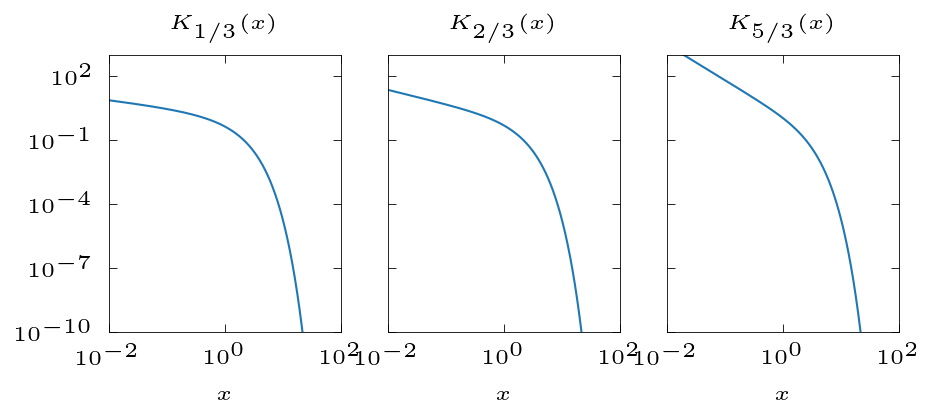

# modifiedBessel
Generate modified Bessel functions relevant to strong field QED

# The modified Bessel functions

$$dW_\mathrm{QED} = \frac{\alpha mc^2}{\sqrt{3}\pi\hbar\gamma} \left[ \left(1-\xi+ \frac{1}{1-\xi} \right)K_{2/3}(\delta) - \int_\delta^\infty K_{1/3}(s)ds  \right] d\xi$$