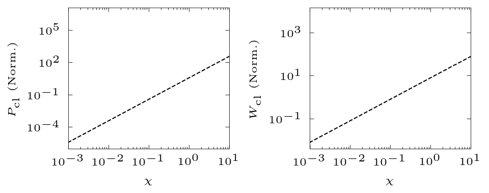

# modifiedBessel
Generating the modified Bessel functions relevant to strong field QED. It set as a framework to build tabulated table for numerical simulation.

# The modified Bessel functions

$$dW_\mathrm{QED} = \frac{\alpha mc^2}{\sqrt{3}\pi\hbar\gamma} \left[ \left(1-\xi+ \frac{1}{1-\xi} \right)K_{2/3}(\delta) - \int_\delta^\infty K_{1/3}(s)ds  \right] d\xi$$
$$dP_\mathrm{QED} = \frac{\hbar\omega}{mc^2} dW_\mathrm{QED}=\frac{\alpha mc^2}{\sqrt{3}\pi\hbar} \left[ \left(1-\xi+ \frac{1}{1-\xi} \right)K_{2/3}(\delta) - \int_\delta^\infty K_{1/3}(s)ds  \right] \xi d\xi$$
$$\delta=\frac{2\xi}{3\chi(1-\xi)};\,\xi=\frac{\hbar\omega}{\gamma mc^2}$$

$$ P_\mathrm{QED} = \frac{\alpha mc^2}{\sqrt{3}\pi\hbar}  \int_0^1 f_e(\xi,\chi)\xi d\xi$$

$$ f_e(\xi,\chi) = \left(1-\xi+ \frac{1}{1-\xi} \right)K_{2/3}(\delta) - \int_\delta^\infty K_{1/3}(s)ds $$

$$ W_\mathrm{QED}\approx 1.46 \frac{\alpha mc^2}{\hbar \gamma}\chi_e^{2/3} \text{for} \chi>>1$$

# Classical limit, $\hbar\rightarrow 0$
$$dW_\mathrm{cl} = \frac{\alpha mc^2}{\sqrt{3}\hbar\pi\gamma} \left[   2K_{2/3}(\delta) - \int_\delta^\infty K_{1/3}(s)ds  \right] d\xi $$

$$dP_\mathrm{cl}  = \frac{\hbar\omega}{mc^2} dW_\mathrm{cl}= \frac{\alpha mc^2}{\sqrt{3}\pi\hbar}  \left[   2K_{2/3}(\delta) - \int_\delta^\infty K_{1/3}(s)ds  \right] \xi d\xi$$
$$\delta=\frac{2\xi}{3\chi}$$

$$ P_\mathrm{cl} = \frac{\alpha mc^2}{\sqrt{3}\pi\hbar}  \int_0^\infty f^e_\mathrm{cl}(\xi,\chi)\xi d\xi$$

$$ f^e_\mathrm{cl}(\xi,\chi) = 2K_{2/3}(\delta) - \int_\delta^\infty K_{1/3}(s)ds = \int_\delta^\infty K_{5/3}(s)ds $$

In principle $g(\chi)=P_\mathrm{QED}/P_\mathrm{cl}$. In (Erber 1966; Sokolov and Ternov 1968; Blackburn 2020), it is

$$g(\chi)=\frac{9\sqrt{3}}{8\pi} \int_0^\infty \left[ \frac{2u^2K_{5/3}(u)}{(2+3\chi u)^2} + \frac{36\chi^2u^3K_{2/3}(u)}{(2+3\chi u)^4} \right] du$$

The asymptotic expression is

$$ g(\chi_e\ll 1)\approx1-\frac{55}{16}\sqrt(3)\chi + 48\chi^2 $$
$$ g(\chi_e\gg 1)\approx\frac{48}{243}\Gamma(\frac{2}{3})\chi^{-4/3} \times \left[ 1 -\frac{81}{16\Gamma(2/3)}(3\chi)^{-2/3} \right] $$

The analytic approximation to $g(\chi)$ is
$$g(\chi)= \left[ 1 + 4.8(1+\chi)\ln(1+1.7\chi) +2.44\chi^2)^{-2/3} \right]$$

# Pair production

$$dW_\mathrm{p} = \frac{\alpha mc^2}{\sqrt{3}\pi\hbar}\left(\frac{mc^2}{\epsilon_h} \right) \left[ \left(\frac{\eta_+}{\eta_-} + \frac{\eta_-}{\eta_+} \right)K_{2/3}(\delta) + \int_\delta^\infty K_{1/3}(s)ds  \right] d\eta_-$$

$$dW_\mathrm{p}=\frac{\alpha mc^2}{\sqrt{3}\pi\hbar} \left(\frac{mc^2}{\epsilon_h} \right) f_p(\eta_-,\chi) d\eta_-$$

$$\delta=\frac{2}{3\eta_-\eta_+\chi};\,\eta_-=\frac{\epsilon_e}{\epsilon_h};\,\eta_+=1-\eta_- $$

$$ f_p(\eta_-,\chi) = \left[ \left(\frac{\eta_+}{\eta_-} + \frac{\eta_-}{\eta_+} \right)K_{2/3}(\delta) + \int_\delta^\infty K_{1/3}(s)ds  \right] $$

